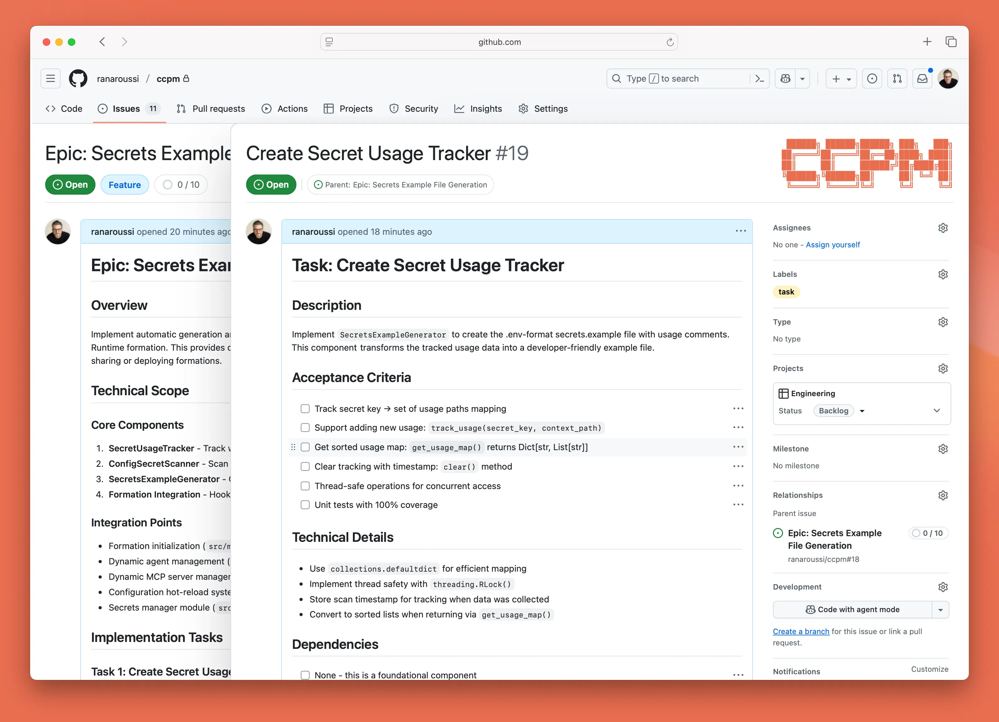

# Claude Code 项目管理

> 翻译自：https://github.com/automazeio/ccpm/
> 
> 自用
### Claude Code 工作流程，通过规范驱动开发、GitHub issues、Git worktrees 和并行运行的多个 AI 代理来更好地交付

停止丢失上下文。停止在任务上阻塞。停止交付错误。这个经过实战检验的系统将 PRD 转换为史诗任务，将史诗任务转换为 GitHub issues，并将 issues 转换为生产代码——每一步都有完整的可追溯性。



## 目录

- [背景](#背景)
- [工作流程](#工作流程)
- [与众不同之处](#与众不同之处)
- [为什么选择 GitHub Issues？](#为什么选择-github-issues)
- [核心原则：拒绝随意编码](#核心原则拒绝随意编码)
- [系统架构](#系统架构)
- [工作流程阶段](#工作流程阶段)
- [命令参考](#命令参考)
- [并行执行系统](#并行执行系统)
- [关键特性与优势](#关键特性与优势)
- [已验证的结果](#已验证的结果)
- [示例流程](#示例流程)
- [立即开始](#立即开始)
- [本地 vs 远程](#本地-vs-远程)
- [技术说明](#技术说明)
- [支持此项目](#支持此项目)

## 背景

每个团队都面临同样的问题：
- **会话之间上下文消失**，导致不断重新发现
- **并行工作产生冲突**，当多个开发者接触相同代码时
- **需求漂移**，口头决定覆盖书面规范
- **进度变得不可见**，直到最后

这个系统解决了所有这些问题。

## 工作流程


### 实际操作演示（60秒）

```bash
# 通过引导式头脑风暴创建全面的 PRD
/pm:prd-new memory-system

# 将 PRD 转换为技术史诗任务与任务分解
/pm:prd-parse memory-system

# 推送到 GitHub 并开始并行执行
/pm:epic-oneshot memory-system
/pm:issue-start 1235
```

## 与众不同之处

| 传统开发 | Claude Code PM 系统 |
|------------------------|----------------------|
| 会话之间丢失上下文 | **持久化上下文** 贯穿所有工作 |
| 串行任务执行 | **并行代理** 处理独立任务 |
| 基于记忆的"随意编码" | **规范驱动** 具有完整可追溯性 |
| 进度隐藏在分支中 | **透明的审计跟踪** 在 GitHub 中 |
| 手动任务协调 | **智能优先级** 使用 `/pm:next` |

## 为什么选择 GitHub Issues？

大多数 Claude Code 工作流程在隔离环境中运行——单个开发者在本地环境中与 AI 合作。这产生了一个根本问题：**AI 辅助开发变成了孤岛**。

通过使用 GitHub Issues 作为我们的数据库，我们解锁了强大的功能：

### 🤝 **真正的团队协作**
- 多个 Claude 实例可以同时处理同一项目
- 人类开发者通过 issue 评论实时查看 AI 进度
- 团队成员可以随时加入——上下文始终可见
- 管理者在不中断流程的情况下获得透明度

### 🔄 **无缝的人机交接**
- AI 可以开始任务，人类可以完成（反之亦然）
- 进度更新对每个人可见，不会困在聊天记录中
- 代码审查通过 PR 评论自然发生
- 没有"AI 做了什么？"的会议

### 📈 **超越单人工作的可扩展性**
- 添加团队成员无需入职摩擦
- 多个 AI 代理在不同问题上并行工作
- 分布式团队自动保持同步
- 与现有的 GitHub 工作流程和工具配合使用

### 🎯 **单一事实来源**
- 无需单独的数据库或项目管理工具
- Issue 状态就是项目状态
- 评论是审计跟踪
- 标签提供组织

这不仅仅是一个项目管理系统——它是一个**协作协议**，让人类和 AI 代理能够使用团队已经信任的基础设施大规模协作。

## 核心原则：拒绝随意编码

> **每一行代码都必须可追溯到规范。**

我们遵循严格的 5 阶段纪律：

1. **🧠 头脑风暴** - 深入思考
2. **📝 文档化** - 编写不留解释余地的规范
3. **📐 规划** - 进行明确技术决策的架构设计
4. **⚡ 执行** - 精确构建规范要求的内容
5. **📊 跟踪** - 在每一步保持透明的进度

没有捷径。没有假设。没有遗憾。

## 系统架构

```
.claude/
├── CLAUDE.md          # 始终在线的指令（将内容复制到项目的 CLAUDE.md 文件）
├── agents/            # 面向任务的代理（用于上下文保持）
├── commands/          # 命令定义
│   ├── context/       # 创建、更新和准备上下文
│   ├── pm/            # ← 项目管理命令（此系统）
│   └── testing/       # 准备和执行测试（编辑此文件）
├── context/           # 项目范围的上下文文件
├── epics/             # ← PM 的本地工作区（放置在 .gitignore 中）
│   └── [epic-name]/   # 史诗任务和相关任务
│       ├── epic.md    # 实现计划
│       ├── [#].md     # 单个任务文件
│       └── updates/   # 进行中的更新
├── prds/              # ← PM 的 PRD 文件
├── rules/             # 将您想要引用的任何规则文件放在此处
└── scripts/           # 将您想要使用的任何脚本文件放在此处
```

## 工作流程阶段

### 1. 产品规划阶段

```bash
/pm:prd-new feature-name
```
启动全面的头脑风暴，创建产品需求文档，捕捉愿景、用户故事、成功标准和约束条件。

**输出：** `.claude/prds/feature-name.md`

### 2. 实现规划阶段

```bash
/pm:prd-parse feature-name
```
将 PRD 转换为技术实现计划，包含架构决策、技术方法和依赖映射。

**输出：** `.claude/epics/feature-name/epic.md`

### 3. 任务分解阶段

```bash
/pm:epic-decompose feature-name
```
将史诗任务分解为具体、可操作的任务，包含验收标准、工作量估算和并行化标志。

**输出：** `.claude/epics/feature-name/[task].md`

### 4. GitHub 同步

```bash
/pm:epic-sync feature-name
# 或者对于自信的工作流程：
/pm:epic-oneshot feature-name
```
将史诗任务和任务推送到 GitHub 作为 issues，带有适当的标签和关系。

### 5. 执行阶段

```bash
/pm:issue-start 1234  # 启动专门代理
/pm:issue-sync 1234   # 推送进度更新
/pm:next             # 获取下一个优先任务
```
专门代理实现任务，同时保持进度更新和审计跟踪。

## 命令参考

> [!TIP]
> 输入 `/pm:help` 获取简洁的命令摘要

### 初始设置
- `/pm:init` - 安装依赖并配置 GitHub

### PRD 命令
- `/pm:prd-new` - 启动新产品需求的头脑风暴
- `/pm:prd-parse` - 将 PRD 转换为实现史诗任务
- `/pm:prd-list` - 列出所有 PRD
- `/pm:prd-edit` - 编辑现有 PRD
- `/pm:prd-status` - 显示 PRD 实现状态

### 史诗任务命令
- `/pm:epic-decompose` - 将史诗任务分解为任务文件
- `/pm:epic-sync` - 将史诗任务和任务推送到 GitHub
- `/pm:epic-oneshot` - 一步完成分解和同步
- `/pm:epic-list` - 列出所有史诗任务
- `/pm:epic-show` - 显示史诗任务及其任务
- `/pm:epic-close` - 标记史诗任务为完成
- `/pm:epic-edit` - 编辑史诗任务详情
- `/pm:epic-refresh` - 从任务更新史诗任务进度

### Issue 命令
- `/pm:issue-show` - 显示 issue 和子 issues
- `/pm:issue-status` - 检查 issue 状态
- `/pm:issue-start` - 开始工作与专门代理
- `/pm:issue-sync` - 将更新推送到 GitHub
- `/pm:issue-close` - 标记 issue 为完成
- `/pm:issue-reopen` - 重新打开已关闭的 issue
- `/pm:issue-edit` - 编辑 issue 详情

### 工作流程命令
- `/pm:next` - 显示下一个优先 issue 及其史诗任务上下文
- `/pm:status` - 整体项目仪表板
- `/pm:standup` - 每日站会报告
- `/pm:blocked` - 显示被阻塞的任务
- `/pm:in-progress` - 列出进行中的工作

### 同步命令
- `/pm:sync` - 与 GitHub 完全双向同步
- `/pm:import` - 导入现有的 GitHub issues

### 维护命令
- `/pm:validate` - 检查系统完整性
- `/pm:clean` - 归档已完成的工作
- `/pm:search` - 搜索所有内容

## 并行执行系统

### Issues 不是原子的

传统思维：一个 issue = 一个开发者 = 一个任务

**现实：一个 issue = 多个并行工作流**

单个"实现用户认证"的 issue 不是一个任务。它是...

- **代理 1**：数据库表和迁移
- **代理 2**：服务层和业务逻辑
- **代理 3**：API 端点和中间件
- **代理 4**：UI 组件和表单
- **代理 5**：测试套件和文档

所有这些都在同一个 worktree 中**同时**运行。

### 速度的数学

**传统方法：**
- 包含 3 个 issues 的史诗任务
- 顺序执行

**此系统：**
- 相同的史诗任务包含 3 个 issues
- 每个 issue 分解为约 4 个并行流
- **12 个代理同时工作**

我们不是将代理分配给 issues。我们是**利用多个代理**来更快交付。

### 上下文优化

**传统的单线程方法：**
- 主对话承载所有实现细节
- 上下文窗口充满数据库模式、API 代码、UI 组件
- 最终达到上下文限制并失去连贯性

**并行代理方法：**
- 主线程保持干净和战略性
- 每个代理独立处理自己的上下文
- 实现细节永远不会污染主对话
- 主线程保持监督而不会淹没在代码中

您的主对话成为指挥者，而不是管弦乐队。

### GitHub vs 本地：完美的分离

**GitHub 看到的：**
- 干净、简单的问题
- 进度更新
- 完成状态

**本地实际发生的事情：**
- Issue #1234 分解为 5 个并行代理
- 代理通过 Git 提交协调
- 复杂的编排对视图隐藏

GitHub 不需要知道工作是如何完成的——只需要知道工作已经完成。

### 命令流程

```bash
# 分析可以并行化的内容
/pm:issue-analyze 1234

# 启动集群
/pm:epic-start memory-system

# 观看奇迹
# 12 个代理在 3 个 issues 上工作
# 全部在：../epic-memory-system/

# 完成时一次干净的合并
/pm:epic-merge memory-system
```

## 关键特性与优势

### 🧠 **上下文保持**
永远不再丢失项目状态。每个史诗任务维护自己的上下文，代理从 `.claude/context/` 读取，并在同步前本地更新。

### ⚡ **并行执行**
通过多个代理同时工作更快交付。标记为 `parallel: true` 的任务支持无冲突的并发开发。

### 🔗 **GitHub 原生**
与团队已经使用的工具配合。Issues 是事实来源，评论提供历史，不依赖 Projects API。

### 🤖 **代理专业化**
每项工作都有合适的工具。不同的代理用于 UI、API 和数据库工作。每个代理读取需求并自动发布更新。

### 📊 **完整可追溯性**
每个决策都有文档记录。PRD → 史诗任务 → 任务 → Issue → 代码 → 提交。从想法到生产的完整审计跟踪。

### 🚀 **开发者生产力**
专注于构建，而不是管理。智能优先级、自动上下文加载和准备就绪时的增量同步。

## 已验证的结果

使用此系统的团队报告：
- **89% 更少的时间** 丢失在上下文切换上——您将更少使用 `/compact` 和 `/clear`
- **5-8 个并行任务** vs 之前 1 个——同时编辑/测试多个文件
- **75% 减少** 错误率——由于将功能分解为详细任务
- **高达 3 倍更快** 的功能交付——基于功能大小和复杂性

## 示例流程

```bash
# 开始新功能
/pm:prd-new memory-system

# 审查和完善 PRD...

# 创建实现计划
/pm:prd-parse memory-system

# 审查史诗任务...

# 分解为任务并推送到 GitHub
/pm:epic-oneshot memory-system
# 创建 issues：#1234 (史诗任务), #1235, #1236 (任务)

# 开始开发任务
/pm:issue-start 1235
# 代理开始工作，维护本地进度

# 同步进度到 GitHub
/pm:issue-sync 1235
# 更新作为 issue 评论发布

# 检查整体状态
/pm:epic-show memory-system
```

## 立即开始

### 快速设置（2 分钟）

1. **将此仓库克隆到您的项目中**：
   ```bash
   cd path/to/your/project/
   git clone https://github.com/automazeio/ccpm.git .
   ```
   > ⚠️ **重要**：如果您已经有 `.claude` 目录，请将此仓库克隆到不同的目录，然后将克隆的 `.claude` 目录内容复制到您项目的 `.claude` 目录。

2. **初始化 PM 系统**：
   ```bash
   /pm:init
   ```
   此命令将：
   - 安装 GitHub CLI（如果需要）
   - 与 GitHub 认证
   - 安装 [gh-sub-issue 扩展](https://github.com/yahsan2/gh-sub-issue) 以实现正确的父子关系
   - 创建所需目录
   - 更新 .gitignore

3. **创建 `CLAUDE.md`** 并包含您的仓库信息
   ```bash
   /init include rules from .claude/CLAUDE.md
   ```
   > 如果您已经有 `CLAUDE.md` 文件，运行：`/re-init` 以使用 `.claude/CLAUDE.md` 中的重要规则更新它。

4. **准备系统**：
   ```bash
   /context:create
   ```


### 开始您的第一个功能

```bash
/pm:prd-new your-feature-name
```

观看结构化规划如何转变为交付的代码。

## 本地 vs 远程

| 操作 | 本地 | GitHub |
|-----------|-------|--------|
| PRD 创建 | ✅ | — |
| 实现规划 | ✅ | — |
| 任务分解 | ✅ | ✅ (同步) |
| 执行 | ✅ | — |
| 状态更新 | ✅ | ✅ (同步) |
| 最终交付 | — | ✅ |

## 技术说明

### GitHub 集成
- 使用 **gh-sub-issue 扩展** 实现正确的父子关系
- 如果未安装扩展则回退到任务列表
- 史诗任务 issues 自动跟踪子任务完成情况
- 标签提供额外组织 (`epic:feature`, `task:feature`)

### 文件命名约定
- 任务在分解期间以 `001.md`, `002.md` 开始
- GitHub 同步后，重命名为 `{issue-id}.md` (例如, `1234.md`)
- 便于导航：issue #1234 = 文件 `1234.md`

### 设计决策
- 有意避免 GitHub Projects API 的复杂性
- 所有命令首先在本地文件上操作以提高速度
- 与 GitHub 的同步是显式和受控的
- Worktrees 为并行工作提供干净的 git 隔离
- GitHub Projects 可以单独添加用于可视化

---

## 支持此项目

Claude Code PM 由 [Automaze](https://automaze.io) 开发，**为交付的开发者，由交付的开发者**。

如果 Claude Code PM 帮助您的团队交付更好的软件：

- ⭐ **[Star 此仓库](https://github.com/your-username/claude-code-pm)** 以表示支持
- 🐦 **[在 X 上关注 @aroussi](https://x.com/aroussi)** 获取更新和提示


---

> [!TIP]
> **使用 Automaze 更快交付。** 我们与创始人合作，将他们的愿景变为现实，扩展他们的业务，并优化成功。
> **[访问 Automaze 与我预约通话 ›](https://automaze.io)**


